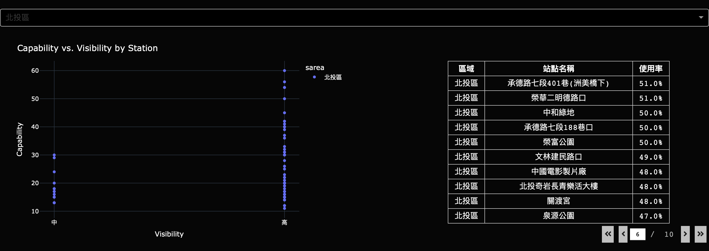

# YouBike Visual Website

## 專案概述
該專案提供各種數據視圖和互動功能，幫助用戶更好地理解和分析自行車使用情況。

## 資料集使用
- **[即時 YouBike 使用數據](https://data.taipei/dataset/detail?id=c6bc8aed-557d-41d5-bfb1-8da24f78f2fb)**：抓取一週站點即時資訊 (2024/9/8~2024/9/14，日->六)，資料每五分鐘更新一次 
- **[區域人口密度數據](https://data.taipei/dataset/detail?id=08f12111-5856-4f15-bc13-ae14fed5bd9d)**：使用 2024 年最新的區域人口密度資訊 
- **[見車率數據](https://data.taipei/dataset/detail?id=ba0dafae-043c-4730-b97e-2defd7af766c)**：90% 以上為高見車率；60%~90% 為中見車率；60% 以下為低見車率 
- **[起迄站點統計資訊](https://data.taipei/dataset/detail?id=c7dbdb7c-6bbd-495a-bd23-49b22defd83e)**：統計不同起迄站的交易次數 

## 執行流程
- **資料前處理：將資料前處理並放置SQLite3 DataBase**: 
  - 抓取資料：data_engineering/data_retrieval.py
  - 清整資料：data_engineering/data_cleaning.sql
- **資料分析：連接SQLite3執行查詢**: 
  - 分析資料：data_visualization/queries.sql
- **資料視覺化：使用Python Dash**: 
  - 建置網站主程式：data_visualization/app.py
  - 細調呈現樣式：data_visualization/styles.py
- **啟動網站**:
  - git clone https://github.com/sodasmile1121/youbike_visual_website.git
  - cd data_visualization
  - python3 app.py

## 分析結果建議
- **推廣腳踏車觀光路線**:
  - 發現：消費者多騎乘Youbike通勤而非觀光
    - 從整體每日使用量可以看出假日使用量較少
    -  
    - 從騎乘跨區比例低可以推測出多半為短程使用
    -  
    - 從Top 15路線可以看出，除了大稻埕外，多半使用者騎乘至捷運站/圖書館/學校等通勤用途
    - 
- **偏離市中心的非主要站點考慮減少車輛提供**：
  - 發現：偏離市中心的站點約一半使用率不達五成
    - 人口密度不是造成使用量低的原因，偏離市中心才是
    -   
    - 在非捷運站或特殊景點的站點使用量低落（ex. 小公園or路口）
      - 
      - 
      - 
- **台大人多且近捷運站的站點增設腳特車量**：
  - 發現：假日使用量較高，可能是受到觀光客的影響，而平日使用量則主要集中在通勤時段
    - 每日使用量與其他區域呈現相反-假日使用量反而高
    -  
    - 假日使用量常突破90%
    -  
    - 平日課間使用量明顯下跌，而上下學時段的使用量較高（推測台大學生多數擁有自己的腳踏車，公共腳踏車的使用主要集中在通勤時段）
    -  
    - 車輛可見率低的站點集中在通識教學樓&近捷運站地
    -  

